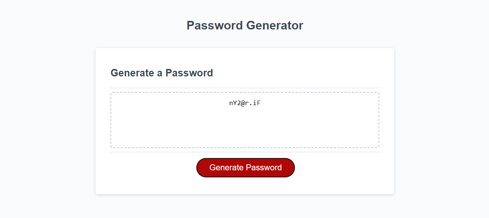

# Password Generator Remodel

## Description
Was designed so that users can create a functional password, based on input such as how long they want it and if it includes capital letters, lowercase letters, numbers and symbols. Allows users to generate unique passwords that can be used for whatever they desire. I learned that it makes for mindless password creation, but make sure to save it or write it down somehwere so you don't forget!

## Usage
Used to help generate a password that users can make their own by choice of how long or short (between 8 and 128 characters) they would like the password to be, and other functions such of what type of characters to include!
 

## Links
Live URL:
GitHub Repo: https://github.com/Jdanders99/Password-Gen-Remodel

## License
MIT License

Copyright (c) [2022] [Jakob Anderson]

Permission is hereby granted, free of charge, to any person obtaining a copy of this software and associated documentation files (the "Software"), to deal in the Software without restriction, including without limitation the rights to use, copy, modify, merge, publish, distribute, sublicense, and/or sell copies of the Software, and to permit persons to whom the Software is furnished to do so, subject to the following conditions:

The above copyright notice and this permission notice shall be included in all copies or substantial portions of the Software.

THE SOFTWARE IS PROVIDED "AS IS", WITHOUT WARRANTY OF ANY KIND, EXPRESS OR IMPLIED, INCLUDING BUT NOT LIMITED TO THE WARRANTIES OF MERCHANTABILITY, FITNESS FOR A PARTICULAR PURPOSE AND NONINFRINGEMENT. IN NO EVENT SHALL THE AUTHORS OR COPYRIGHT HOLDERS BE LIABLE FOR ANY CLAIM, DAMAGES OR OTHER LIABILITY, WHETHER IN AN ACTION OF CONTRACT, TORT OR OTHERWISE, ARISING FROM, OUT OF OR IN CONNECTION WITH THE SOFTWARE OR THE USE OR OTHER DEALINGS IN THE SOFTWARE.
